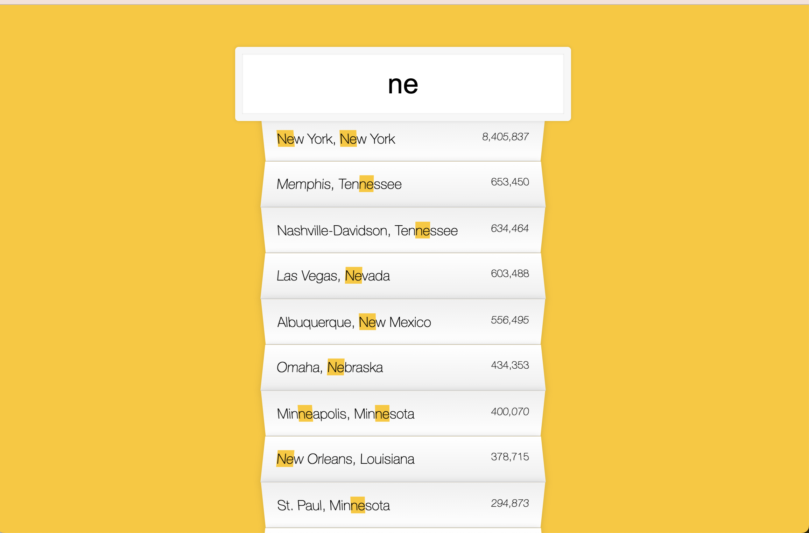

# ajax_type_ahead

This is a 30-days javascript grinding  
js30 [https://github.com/ningh98/js30]  
6. Ajax type ahead [https://github.com/ningh98/ajax_type_ahead]

## Table of contents

- [Overview](#overview)
  - [Screenshot](#screenshot)
  - [Links](#links)
- [My process](#my-process)
  - [Built with](#built-with)
  - [What I learned](#what-i-learned)


## Overview

An interactive "type-ahead" search feature that dynamically displays matching cities and states from a dataset as the user type

### Screenshot




### Links

- Live Site URL: [https://ningh98.github.io/ajax_type_ahead/]

## My process

### Built with

- HTML
- CSS
- Javascript


### What I learned


```js
const endpoint = 'https://gist.githubusercontent.com/Miserlou/c5cd8364bf9b2420bb29/raw/2bf258763cdddd704f8ffd3ea9a3e81d25e2c6f6/cities.json';
const cities = [];

fetch(endpoint)
  .then(blob => blob.json())
  .then(data => cities.push(...data))
```
fetch data and use spread operator
